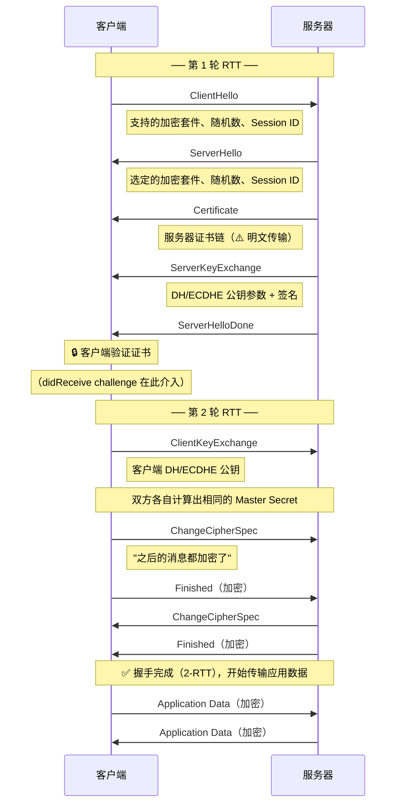
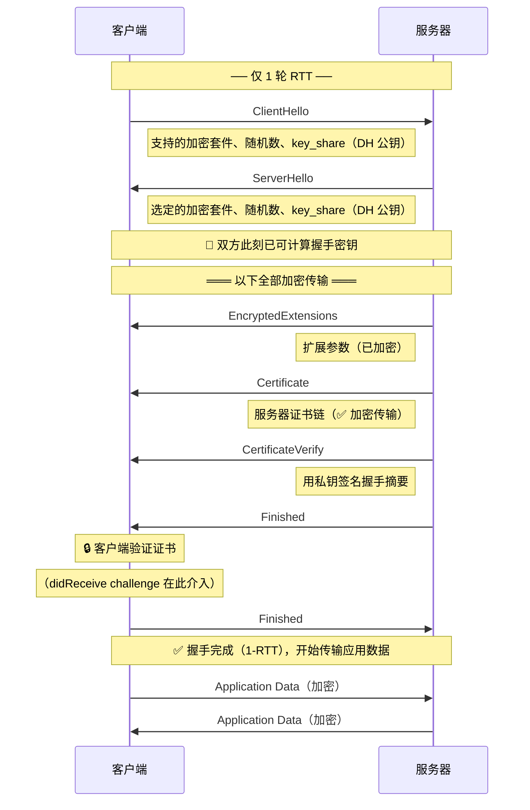

# URLSessionTaskDelegate 的 didReceive challenge 回调详解

> 文档来源：通过 Dash API 查询 Apple API Reference

## 方法签名

```swift
optional func urlSession(
    _ session: URLSession,
    task: URLSessionTask,
    didReceive challenge: URLAuthenticationChallenge,
    completionHandler: @escaping (URLSession.AuthChallengeDisposition, URLCredential?) -> Void
)
```

Swift async 版本：

```swift
optional func urlSession(
    _ session: URLSession,
    task: URLSessionTask,
    didReceive challenge: URLAuthenticationChallenge
) async -> (URLSession.AuthChallengeDisposition, URLCredential?)
```

**所属协议**：`URLSessionTaskDelegate`（继承自 `URLSessionDelegate`）

**可用平台**：iOS 7.0+, macOS 10.9+, tvOS 9.0+, watchOS 2.0+, visionOS 1.0+

---

## 作用

当 TLS 握手过程中需要验证服务器证书，或服务器要求 HTTP 认证（Basic/Digest 等）时，**iOS 系统**会调用此方法，给你的 App 一个决策点：是否信任对方、以及提供什么凭证。最常见的使用场景是 **SSL/TLS 服务器信任验证（Server Trust Evaluation）**，也就是 SSL Pinning 的切入点。

> ⚠️ 注意：Apple 文档原文是 "when a remote server asks for authentication"，容易误解为服务器主动发起请求。实际上对于 SSL/TLS 场景，是**客户端发起连接 → 服务器在 TLS 握手中发送证书 → iOS 系统拦截并回调你的 App**，整个过程由客户端驱动。

## 参数

| 参数 | 类型 | 说明 |
|------|------|------|
| `session` | `URLSession` | 包含该 task 的 session |
| `task` | `URLSessionTask` | 需要身份验证的 task |
| `challenge` | `URLAuthenticationChallenge` | 包含身份验证请求的对象，通过 `challenge.protectionSpace` 获取验证类型和服务器信息 |
| `completionHandler` | `(AuthChallengeDisposition, URLCredential?) -> Void` | **必须调用**，传入处理方式和凭证 |

## completionHandler 的 disposition 参数

`URLSession.AuthChallengeDisposition` 枚举有 4 个值：

| 值 | 说明 |
|---|------|
| `.useCredential` | 使用提供的 credential（可以为 nil）继续连接 |
| `.performDefaultHandling` | 走系统默认处理，忽略 credential 参数（等于没实现这个方法） |
| `.cancelAuthenticationChallenge` | 取消整个请求，忽略 credential 参数 |
| `.rejectProtectionSpace` | 拒绝当前验证方式，系统会用下一个可用的验证方式重新调用此方法 |

## 两级 Challenge 的分发规则

系统对不同类型的 challenge 有不同的分发逻辑：

### Session 级 challenge

以下验证类型属于 **session 级**：
- `NSURLAuthenticationMethodNTLM`
- `NSURLAuthenticationMethodNegotiate`
- `NSURLAuthenticationMethodClientCertificate`
- **`NSURLAuthenticationMethodServerTrust`**（SSL Pinning 就是这个）

分发顺序：
1. 先调用 **session delegate** 的 `urlSession(_:didReceive:completionHandler:)`（注意没有 `task:` 参数）
2. 如果 session delegate 没实现该方法，才回退到 **task delegate** 的 `urlSession(_:task:didReceive:completionHandler:)`

### 非 session 级 challenge

其他所有验证类型（如 HTTP Basic、HTTP Digest）：
- 直接调用 **task delegate** 的 `urlSession(_:task:didReceive:completionHandler:)`
- session delegate 的 `urlSession(_:didReceive:completionHandler:)` **不会被调用**

---

## 实战示例：Alamofire 如何使用此回调

Alamofire 的 `SessionDelegate` 实现了此回调，用于 SSL Pinning：

**文件**：`Alamofire/Source/Core/SessionDelegate.swift`

```swift
extension SessionDelegate: URLSessionTaskDelegate {

    open func urlSession(_ session: URLSession,
                         task: URLSessionTask,
                         didReceive challenge: URLAuthenticationChallenge,
                         completionHandler: @escaping (URLSession.AuthChallengeDisposition, URLCredential?) -> Void) {

        let evaluation: ChallengeEvaluation

        // ① 根据 challenge 类型分发
        switch challenge.protectionSpace.authenticationMethod {

        case NSURLAuthenticationMethodHTTPBasic,
             NSURLAuthenticationMethodHTTPDigest,
             NSURLAuthenticationMethodNTLM,
             NSURLAuthenticationMethodNegotiate:
            // HTTP 认证（用户名/密码）
            evaluation = attemptCredentialAuthentication(for: challenge, belongingTo: task)

        case NSURLAuthenticationMethodServerTrust:
            // ② SSL/TLS 服务器信任验证 → 这就是 SSL Pinning 的入口
            evaluation = attemptServerTrustAuthentication(with: challenge)

        case NSURLAuthenticationMethodClientCertificate:
            // 客户端证书认证
            evaluation = attemptCredentialAuthentication(for: challenge, belongingTo: task)

        default:
            evaluation = (.performDefaultHandling, nil, nil)
        }

        // ③ 调用 completionHandler，告诉系统如何处理
        completionHandler(evaluation.disposition, evaluation.credential)
    }
}
```

SSL Pinning 的具体实现在 `attemptServerTrustAuthentication` 中：

```swift
func attemptServerTrustAuthentication(with challenge: URLAuthenticationChallenge) -> ChallengeEvaluation {
    let host = challenge.protectionSpace.host

    // ① 从 challenge 中提取 SecTrust（服务器证书链）
    guard let trust = challenge.protectionSpace.serverTrust else {
        return (.performDefaultHandling, nil, nil)
    }

    do {
        // ② 从 ServerTrustManager 中查找该 host 对应的验证策略
        guard let evaluator = try serverTrustManager?.serverTrustEvaluator(forHost: host) else {
            return (.performDefaultHandling, nil, nil)
        }

        // ③ 执行验证（证书锁定 / 公钥锁定 / 默认验证 等）
        try evaluator.evaluate(trust, forHost: host)

        // ④ 验证通过 → .useCredential
        return (.useCredential, URLCredential(trust: trust), nil)
    } catch {
        // ⑤ 验证失败 → .cancelAuthenticationChallenge
        return (.cancelAuthenticationChallenge, nil, error.asAFError(...))
    }
}
```

---

## 实战示例：自己实现简单的 SSL Pinning

不依赖 Alamofire，直接在自己的 `URLSessionDelegate` 中实现：

```swift
class MySessionDelegate: NSObject, URLSessionTaskDelegate {

    func urlSession(_ session: URLSession,
                    task: URLSessionTask,
                    didReceive challenge: URLAuthenticationChallenge,
                    completionHandler: @escaping (URLSession.AuthChallengeDisposition, URLCredential?) -> Void) {

        // ① 只处理 ServerTrust 类型的 challenge
        guard challenge.protectionSpace.authenticationMethod == NSURLAuthenticationMethodServerTrust,
              let serverTrust = challenge.protectionSpace.serverTrust else {
            completionHandler(.performDefaultHandling, nil)
            return
        }

        // ② 设置 SSL 策略（包含域名校验）
        let host = challenge.protectionSpace.host
        let policy = SecPolicyCreateSSL(true, host as CFString)
        SecTrustSetPolicies(serverTrust, policy)

        // ③ 执行系统默认的证书链验证
        var error: CFError?
        guard SecTrustEvaluateWithError(serverTrust, &error) else {
            completionHandler(.cancelAuthenticationChallenge, nil)
            return
        }

        // ④ （可选）证书锁定：比对服务器证书与预埋证书
        if let serverCert = SecTrustGetCertificateAtIndex(serverTrust, 0),
           let pinnedCertPath = Bundle.main.path(forResource: "my-server", ofType: "cer"),
           let pinnedCertData = try? Data(contentsOf: URL(fileURLWithPath: pinnedCertPath)),
           let pinnedCert = SecCertificateCreateWithData(nil, pinnedCertData as CFData) {

            let serverCertData = SecCertificateCopyData(serverCert) as Data
            let pinnedData = SecCertificateCopyData(pinnedCert) as Data

            if serverCertData == pinnedData {
                // 证书匹配 → 信任
                completionHandler(.useCredential, URLCredential(trust: serverTrust))
            } else {
                // 证书不匹配 → 拒绝
                completionHandler(.cancelAuthenticationChallenge, nil)
            }
        } else {
            // 没有预埋证书，走系统默认验证
            completionHandler(.useCredential, URLCredential(trust: serverTrust))
        }
    }
}
```

---

## 为什么 Starscream 不使用此回调？

Starscream（使用 WSEngine 时）不基于 `URLSession`，而是自己管理 TCP 连接（`NWConnection` 或 `CFStream`），所以**没有 `URLSessionTaskDelegate` 可用**。

它的 SSL Pinning 切入点是：

| Transport | SSL Pinning 介入方式 |
|-----------|---------------------|
| `TCPTransport`（NWConnection） | `sec_protocol_options_set_verify_block` — 在 TLS 握手中插入验证 |
| `FoundationTransport`（CFStream） | Stream `.openCompleted` 事件后手动从 Stream 提取 `SecTrust` |

两者最终都调用 `CertificatePinning.evaluateTrust(trust:domain:completion:)` 来执行验证，只是触发时机和 API 不同。

---

## Q&A

### Q: `didReceive challenge` 回调是服务端发起的吗？客户端没法主动校验？

**不完全准确。** 需要区分三个角色：客户端 App、iOS 系统、服务器。

**实际流程：**

```
客户端 App 发起连接（connect/request）
    → 系统代理客户端进行 TLS 握手
    → 服务器在握手中发送证书
    → 系统收到证书，通过 didReceive challenge 回调问你的 App："你信任吗？"
    → 你在回调里做自定义校验（证书锁定、公钥比对等）
    → 告诉系统结果（.useCredential / .cancelAuthenticationChallenge）
```

**关键澄清：**

1. **TLS 握手是客户端发起的**——你调用 `connect()` / `request()` 时就开始了。
2. **服务器发送证书**是 TLS 协议的标准步骤，不是"服务器主动发起验证请求"。
3. **`didReceive challenge` 是 iOS 系统给你的决策点**——系统拦截了 TLS 握手中的证书验证环节，交给你的 App 决定是否信任。
4. **客户端完全可以做自定义校验**——这个回调就是为此而生的。你可以在里面做证书锁定、公钥比对等任何验证逻辑。
5. **唯一的限制是时机**——校验只能在 TLS 握手阶段触发，你不能在任意时刻主动发起证书验证。

所以 `didReceive challenge` 不是"服务端发起的请求"，而是 **iOS 系统在 TLS 握手流程中提供的一个 hook**。

### Q: 证书公钥、证书、证书密钥——这三个术语是什么意思？

#### 先理解一个前提：非对称加密

TLS 的核心依赖**非对称加密**——一对数学上关联的密钥：

- **用公钥加密的数据，只有私钥能解密**
- **用私钥签名的数据，任何人用公钥都能验证签名**

这对密钥就是下面三个术语的基础。

#### "加密"和"签名"的区别

虽然都用到公钥/私钥，但**目的完全不同**：

| | 加密 (Encryption) | 签名 (Signature) |
|---|---|---|
| **目的** | **保密**——不让别人看到内容 | **证明身份**——证明是我发的，且内容没被篡改 |
| **谁操作** | 发送方加密 | 发送方签名 |
| **用哪把钥匙** | 发送方用**对方的公钥**加密 | 发送方用**自己的私钥**签名 |
| **谁能解/验** | 只有**私钥持有者**能解密 | **任何人**用公钥都能验证 |
| **类比** | 把信锁进只有收件人能打开的保险箱 | 在信上盖章——任何人都能验证章是不是你的，但只有你能盖 |

**具体过程对比：**

```
加密过程：
  原文 ──── 对方的公钥加密 ────▶ 密文 ──── 对方的私钥解密 ────▶ 原文
  目的：只有对方能看到内容

签名过程：
  原文 ──── Hash ────▶ 摘要 ──── 自己的私钥签名 ────▶ 签名值
  验证：原文 ──── Hash ────▶ 摘要 ──── 与用公钥解出的摘要比对 ────▶ 匹配？
  目的：证明内容来自私钥持有者，且未被篡改
```

> **注意签名不是"加密原文"**——签名是对原文的**哈希摘要**进行私钥运算。原文本身是明文传输的，任何人都能看到。签名只保证"这段内容确实是我发的，没人改过"。

#### 公钥能签名吗？私钥能加密吗？

**从数学上说**，RSA 的公钥和私钥在运算上是对称的——用公钥做的运算可以用私钥逆向，反之亦然。所以在纯数学层面，"用公钥签名"和"用私钥加密"在运算上是可行的。

**但在实际使用中，不应该也不会这样做**：

| 操作 | 能不能做 | 为什么不做 |
|------|---------|-----------|
| 公钥签名？ | ❌ 无意义 | 公钥是公开的，任何人都有。"用公钥签名"等于任何人都能签——无法证明身份 |
| 私钥加密？ | ❌ 无意义 | 对应的公钥是公开的，任何人都能解密——无法保密 |

```
"用私钥加密" → 任何人用公钥都能解 → 不是加密，本质上就是签名
"用公钥签名" → 任何人都能签 → 证明不了任何身份
```

所以正确的用法永远是：

```
加密：公钥加密 → 私钥解密     （保密：只有私钥持有者能看）
签名：私钥签名 → 公钥验签     （认证：证明来自私钥持有者）
```

#### 在 TLS 握手中的实际体现

```
服务器                                         客户端

Certificate（含公钥）  ──────────────────────▶  收到公钥
                                               但怎么确定这个公钥真的属于 example.com？

CertificateVerify     ──────────────────────▶  验证签名
  = 用私钥对握手摘要签名                          用证书里的公钥验签
                                               ✅ 能验通 → 对方确实持有私钥 → 身份可信
                                               （这是"签名"，不是"加密"——握手摘要本身不需要保密）
```

TLS 握手中**没有用公钥加密应用数据**（TLS 1.3 甚至禁止了 RSA 密钥交换）。公钥/私钥只用于**签名验证身份**和**密钥协商**，真正的数据加密由协商出的对称密钥（AES）完成。

#### 为什么不直接用服务端的公钥/私钥加密数据？

看起来服务器已经有现成的公钥/私钥对了，为什么还要多此一举协商出对称密钥？原因有三个，**按重要程度排序**：

> **先澄清术语**：
>
> | 术语 | 全称 | 含义 |
> |------|------|------|
> | **对称加密** | Symmetric Encryption | 加密和解密使用**同一把密钥**。如 AES（Advanced Encryption Standard，高级加密标准） |
> | **非对称加密** | Asymmetric Encryption | 加密和解密使用**不同的密钥**（公钥/私钥）。如 RSA |
> | **密钥协商** | Key Exchange / Key Agreement | 双方通过交换公开信息，各自**独立计算出相同的对称密钥**，而这个密钥本身从未在网络上传输。密钥协商不是加密方式，而是**安全地产生对称密钥的过程** |
> | **DH** | Diffie-Hellman（迪菲-赫尔曼密钥交换） | 最经典的密钥协商算法 |
> | **ECDHE** | Ephemeral Elliptic Curve Diffie-Hellman（临时椭圆曲线迪菲-赫尔曼） | DH 的改进版：用椭圆曲线数学（更短的密钥、更高的安全性），且每次连接用**临时 (Ephemeral)** 密钥对 |
> | **CA** | Certificate Authority（证书颁发机构） | 受信任的第三方机构（如 DigiCert、Let's Encrypt），负责**验证域名所有者身份并签发证书**。CA 用自己的私钥对证书签名，客户端用 CA 的公钥（预装在操作系统中）验签，从而确认证书的真实性。整个 TLS 信任体系的根基 |

**① 前向保密 (Forward Secrecy，前向保密性) —— 最关键的原因**

如果直接用服务器公钥加密数据，一旦服务器私钥在**未来某天**泄露，攻击者可以解密**过去录制的所有流量**：

```
直接用公钥加密（无前向保密）：
  攻击者今天录制密文 → 明年私钥泄露 → 用私钥解密所有历史流量 ❌

用 ECDHE 密钥协商（有前向保密）：
  每次连接生成临时密钥对 → 连接结束后临时私钥销毁
  → 即使服务器长期私钥泄露，也无法解密过去的流量 ✅
```

这就是 TLS 1.3 **强制要求 ECDHE**、**禁止静态 RSA 密钥交换**的原因。

**② 性能 —— 差距巨大**

| 算法类型 | 示例 | 速度 |
|---------|------|------|
| 非对称加密（RSA 2048） | 公钥加密/私钥解密 | ~1,000 次/秒 |
| 对称加密（AES-256-GCM） | 加密/解密 | ~数 GB/秒 |

非对称加密比对称加密**慢几千倍**。用 RSA 加密每一个 WebSocket 帧的 payload，性能完全不可接受。

**③ 架构限制 —— 单向加密问题**

公钥/私钥是**单向**的——只有客户端能用公钥加密发给服务器。服务器要发数据给客户端怎么办？

```
客户端 → 服务器：用服务器公钥加密 ✅（只有服务器能解）
服务器 → 客户端：用什么加密？❌
  - 用服务器私钥"加密"？任何人用公钥都能解，等于明文
  - 客户端也生成密钥对、互发公钥？那本质上就是在做密钥协商了
    （而且还没有前向保密，不如直接用 ECDHE）
```

而对称密钥双方共享，**双向加解密**天然支持。

**密钥协商（ECDHE）具体怎么工作？**

密钥协商的巧妙之处在于：**双方各自生成临时密钥对，只交换公钥，但能各自算出相同的对称密钥**——这个对称密钥从未在网络上传输过。

```
客户端                                           服务器

生成临时密钥对：                                   生成临时密钥对：
  客户端临时私钥 a（保密）                            服务器临时私钥 b（保密）
  客户端临时公钥 A = a×G                             服务器临时公钥 B = b×G

           A（客户端临时公钥）
        ─────────────────────────▶
                                    B（服务器临时公钥）
        ◀─────────────────────────

客户端计算：                                       服务器计算：
  共享密钥 = a × B = a×b×G                          共享密钥 = b × A = b×a×G
                  ↕                                              ↕
              结果相同！                                      结果相同！
              ════════                                       ════════

攻击者只能看到 A 和 B（两个公钥）
但无法从 A 和 B 反推出 a 或 b（椭圆曲线离散对数问题，计算上不可行）
→ 无法算出共享密钥
```

> 这里的 G 是椭圆曲线上的一个公开基点，× 是椭圆曲线上的标量乘法。关键的数学性质是：知道 A=a×G 和 B=b×G，无法算出 a×b×G（除非知道 a 或 b）。

**总结：三者各司其职**

```
非对称加密（RSA/ECDSA）：  身份验证——用私钥签名证明"我是谁"
密钥协商（ECDHE）：       密钥生成——安全地协商出临时对称密钥，提供前向保密
对称加密（AES-GCM）：     数据加密——用协商出的密钥加密实际数据，高性能 + 双向
```

```
┌───────────────────────────────────────────────────────┐
│                    TLS 连接                            │
│                                                       │
│  握手阶段（慢，但只做一次）                               │
│  ├─ 非对称（RSA/ECDSA）：私钥签名 → 证明身份             │
│  └─ 密钥协商（ECDHE）：临时密钥交换 → 协商出对称密钥       │
│                                                       │
│  数据阶段（快，持续进行）                                 │
│  └─ 对称（AES-GCM）：加解密所有应用数据                   │
│                                                       │
└───────────────────────────────────────────────────────┘
```

#### 三个术语

```
┌─────────────────────────────────────────────────────────────┐
│                     证书 (Certificate)                       │
│                                                             │
│  ┌─────────────────────────────────────────────────────┐    │
│  │  主体 (Subject): example.com                        │    │
│  │  公钥 (Public Key): 04:a3:2f:...                    │  ← 公钥嵌在证书里面
│  │  颁发者 (Issuer): DigiCert CA                       │    │
│  │  有效期: 2025-01-01 ~ 2026-01-01                    │    │
│  │  CA 的签名: 30:44:02:20:...                         │  ← CA 用自己的私钥签的
│  └─────────────────────────────────────────────────────┘    │
│                                                             │
└─────────────────────────────────────────────────────────────┘

私钥 (Private Key): 保存在服务器上，绝不传输
```

| 术语 | 是什么 | 谁持有 | 类比 |
|------|--------|--------|------|
| **私钥 (Private Key)** | 密钥对的私有部分 | 仅服务器持有，**绝不传输** | 你的印章原件——只有你能盖章 |
| **公钥 (Public Key)** | 密钥对的公开部分 | 嵌在证书里，任何人可获取 | 印章的鉴定标准——任何人能验证盖章是否真实 |
| **证书 (Certificate)** | 包含公钥 + 身份信息的**签名文档** | 服务器发给客户端 | 公证处开的身份证明——上面有你的照片（公钥）、姓名（域名）、公证处盖章（CA 签名） |

> **常见混淆**："证书公钥"就是证书里的公钥，"证书密钥"通常指与证书配对的私钥。三者的关系是：**证书 = 公钥 + 身份 + CA 签名**，私钥与证书配对但不在证书里。

#### 在 TLS 握手中，公钥和私钥分别怎么用？

以 TLS 1.3 为例，结合上面的时序图：

```
客户端                                                     服务器
  │                                                          │
  │  ClientHello (key_share: 客户端 DH 公钥)                  │
  │────────────────────────────────────────────────────────▶│
  │                                                          │
  │  ServerHello (key_share: 服务器 DH 公钥)                  │
  │◀────────────────────────────────────────────────────────│
  │                                                          │
  │  Certificate                                             │
  │◀────────────────────────────────────────────────────────│
  │  "这是我的证书，里面有我的公钥和 CA 签名"                     │
  │                                                          │
  │  CertificateVerify                                       │
  │◀────────────────────────────────────────────────────────│
  │  "我用私钥对握手摘要签了名，你用证书里的公钥验证"               │
  │                                                          │
  │  客户端验证：                                              │
  │  ① CA 签名有效吗？→ 用 CA 的公钥验证证书上的签名              │
  │  ② 域名匹配吗？→ 证书的 Subject 是否是 example.com         │
  │  ③ CertificateVerify 签名有效吗？                          │
  │     → 用证书里的公钥验证 → 能验通说明对方确实持有私钥           │
  │                                                          │
  │  ✅ 三项都通过 → 信任该服务器                                │
```

#### 公钥和私钥的使用场景总结

| 场景 | 谁用什么 | 目的 |
|------|---------|------|
| **服务器证明身份** | 服务器用**私钥**签名握手摘要（CertificateVerify） | 证明"我确实是这个证书的持有者" |
| **客户端验证身份** | 客户端用证书里的**公钥**验签 | 确认对方持有私钥，不是冒充的 |
| **验证证书真伪** | 客户端用 **CA 的公钥**验证证书上的 CA 签名 | 确认证书是 CA 颁发的，不是伪造的 |
| **密钥交换 (TLS 1.3)** | 双方各自生成临时 DH 密钥对，交换公钥 | 协商出加密通信用的对称密钥 |
| ~~加密 premaster~~ | ~~TLS 1.2 RSA 模式：客户端用公钥加密~~ | ~~TLS 1.3 已移除，因为没有前向保密~~ |

> **注意**：公钥/私钥**不用于加密应用数据**。它们只在握手阶段用于身份验证和密钥协商。实际的数据传输使用协商出的**对称密钥**（AES 等）加密，因为对称加密比非对称加密快几个数量级。

#### 与 iOS 代码的对应关系

```swift
// challenge.protectionSpace.serverTrust 就是服务器发来的证书链（SecTrust）
// 里面包含了证书（含公钥）+ CA 签名链

// Alamofire 的 PinnedCertificatesTrustEvaluator：
// 比对 证书数据（整个证书，包含公钥+身份+签名）
let serverCertificatesData = Set(trust.af.certificateData)
let pinnedCertificatesData = Set(certificates.af.data)

// Alamofire 的 PublicKeysTrustEvaluator：
// 只比对 公钥（证书续期时公钥可以不变，所以不用更新 App）
for serverPublicKey in trust.af.publicKeys {
    if keys.contains(serverPublicKey) { return true }
}
```

### Q: TLS 握手流程不熟悉，应该看哪个 RFC？

#### 推荐的 RFC 文档

| RFC | 内容 | 推荐度 |
|-----|------|--------|
| [RFC 8446](https://datatracker.ietf.org/doc/html/rfc8446) | **TLS 1.3**（当前主流版本，iOS 12.2+ 默认使用） | ⭐⭐⭐ 优先看这个 |
| [RFC 5246](https://datatracker.ietf.org/doc/html/rfc5246) | **TLS 1.2**（仍广泛使用，iOS/macOS 仍支持） | ⭐⭐ 作为补充 |
| [RFC 6455 Section 11.1.5](https://datatracker.ietf.org/doc/html/rfc6455#section-11.1.5) | WebSocket 的 TLS 要求（`wss://` 方案） | ⭐ 与 Starscream 直接相关 |

#### TLS 1.2 握手流程（2-RTT）



#### TLS 1.3 握手流程（1-RTT）



#### TLS 1.2 vs 1.3 对比

| 维度 | TLS 1.2 | TLS 1.3 |
|------|---------|---------|
| **握手耗时** | 2-RTT | 1-RTT（还支持 0-RTT 恢复） |
| **为什么更快** | 密钥交换参数在第 2 轮才发送 | `key_share` 在 ClientHello 就带上，ServerHello 后立即可算出密钥 |
| **证书是否加密** | ❌ 明文传输（中间人可见你访问了谁） | ✅ 加密传输（ServerHello 后的所有内容都加密） |
| **密钥交换算法** | 支持静态 RSA（无前向保密）+ DHE/ECDHE | **仅允许 ECDHE/DHE**（强制前向保密） |
| **ChangeCipherSpec** | 需要（明确标记"开始加密"） | 已移除（加密时机由协议隐式决定） |
| **证书验证时机** | 收到 `ServerHelloDone` 后 | 收到 `CertificateVerify` 后 |
| **`didReceive challenge` 介入点** | 相同：客户端收到证书后、发送 Finished 前 | 相同 |
| **iOS 最低版本** | iOS 5+ | iOS 12.2+ |

> **核心改进总结**：TLS 1.3 做了三件事——**更快**（1-RTT）、**更安全**（强制前向保密 + 证书加密传输）、**更简洁**（砍掉了不安全的旧算法和冗余消息）。

`didReceive challenge` 在两个版本中的介入点相同：**客户端收到服务器证书后、发送 Finished 前**——iOS 系统在这个时机把控制权交给你的 App。

#### 学习建议

1. **不要从头到尾读 RFC**——TLS RFC 非常长（RFC 8446 有 160 页），直接通读效率极低。

2. **推荐的阅读顺序：**

   | 步骤 | 内容 | RFC 章节 |
   |------|------|---------|
   | ① | 先看握手流程总览 | RFC 8446 [Section 2](https://datatracker.ietf.org/doc/html/rfc8446#section-2)（2 页，有流程图） |
   | ② | 理解证书验证 | RFC 8446 [Section 4.4.2](https://datatracker.ietf.org/doc/html/rfc8446#section-4.4.2)（Certificate 消息） |
   | ③ | 理解密钥交换 | RFC 8446 [Section 4.2.8](https://datatracker.ietf.org/doc/html/rfc8446#section-4.2.8)（Key Share） |
   | ④ | 对比 TLS 1.2 握手 | RFC 5246 [Section 7.3](https://datatracker.ietf.org/doc/html/rfc5246#section-7.3)（多一个 RTT） |

3. **辅助资料**（比直接读 RFC 更友好）：
   - [Cloudflare: What happens in a TLS handshake?](https://www.cloudflare.com/learning/ssl/what-happens-in-a-tls-handshake/) — 最佳入门图文
   - [The Illustrated TLS 1.3 Connection](https://tls13.xargs.org/) — 逐字节解析真实握手包，极其直观
   - [The Illustrated TLS 1.2 Connection](https://tls12.xargs.org/) — 同上，TLS 1.2 版本

4. **与 Starscream/Alamofire 的关联：** 理解握手流程后再回头看代码，你就能明白为什么 `sec_protocol_options_set_verify_block`（Starscream）和 `didReceive challenge`（Alamofire）都是在握手的同一个阶段介入——只是 API 层次不同。

---

## 总结

| 要点 | 内容 |
|------|------|
| **何时被调用** | 服务器要求身份验证时（TLS 握手、HTTP 认证等） |
| **必须做什么** | 调用 `completionHandler`，传入 disposition 和 credential |
| **SSL Pinning 入口** | `challenge.protectionSpace.authenticationMethod == NSURLAuthenticationMethodServerTrust` |
| **核心对象** | `challenge.protectionSpace.serverTrust` → `SecTrust`（服务器证书链） |
| **Alamofire 的用法** | 按 host 查找 evaluator → `evaluator.evaluate(trust, forHost:)` → `.useCredential` 或 `.cancel` |
| **Starscream 不用** | 因为它不基于 URLSession，自己管理 TCP 连接 |

## 个人总结

### TLS 1.2 握手流程（RSA 密钥交换模式）

> ⚠️ 以下描述的是 TLS 1.2 的 **RSA 密钥交换**模式。该模式**没有前向保密**（私钥泄露可解密所有历史流量），已被 TLS 1.3 禁止。TLS 1.2 也支持 DHE/ECDHE 模式（有前向保密），TLS 1.3 则强制使用 ECDHE。

前提：在 TCP 连接建立成功后：

1. 客户端发送 ClientHello 消息，包含它支持的 TLS 版本、加密套件列表和 client random（客户端随机数）
2. 服务端发送 ServerHello 消息，包含它选择的加密套件和 server random（服务端随机数）
3. 服务端发送 Certificate 消息，包含它的 SSL 证书（内含公钥）
4. 服务端发送 ServerHelloDone 消息，表示服务端握手消息发送完毕
5. 客户端用 CA 的公钥验证服务端证书上的 CA 签名，确认证书真实且域名匹配（`didReceive challenge` 在此介入）
6. 客户端**随机生成** premaster secret（预主密钥），用服务端证书中的公钥加密后发送
7. 服务端用私钥解密出 premaster secret
8. 双方各自基于 premaster secret + client random + server random 计算出相同的 session key（会话密钥，对称密钥）
9. 客户端发送 ChangeCipherSpec（通知后续消息开始加密），然后发送用 session key 加密的 Finished 消息
10. 服务端发送 ChangeCipherSpec，然后发送用 session key 加密的 Finished 消息
11. 握手结束，后续数据传输均使用 session key 做对称加密

> **注意**：握手阶段的消息（ClientHello、ServerHello、Certificate 等）本身是**明文**传输的。非对称加密在握手中只用于两件事：**加密 premaster secret**（RSA 模式）和**验证签名**（证书验证）。真正的"全部加密"从 ChangeCipherSpec 之后才开始。

### 中间人攻击 (MITM) 与抓包工具的原理

#### 正常的 TLS 连接为什么能防止中间人攻击？

因为证书验证形成了一条**信任链**：

```
你的 App
  → 验证服务器证书上的 CA 签名
  → CA 的公钥在哪？在系统预装的根证书列表里
  → 根证书是 Apple 预装在 iOS 系统中的，用户/攻击者无法篡改

所以：
  攻击者伪造证书 → 没有 CA 的私钥，无法生成合法的 CA 签名
                 → 客户端验证签名失败 → 拒绝连接 ✅
```

#### 中间人攻击是怎么运作的？

攻击者（中间人）插在客户端和服务器之间，**同时冒充双方**：

```
正常连接：
  客户端 ◄──────── TLS ────────► 服务器

中间人攻击：
  客户端 ◄──── TLS ①────► 中间人 ◄──── TLS ② ────► 服务器
               假连接                     真连接

  TLS ①：中间人冒充服务器，给客户端发自己的假证书
  TLS ②：中间人作为普通客户端，与真服务器正常建立连接
```

具体过程（对照 TLS 1.2 握手流程）：

```
客户端                        中间人                        真实服务器

1. ClientHello ──────────▶  截获
                             2. 转发 ClientHello ──────────▶
                             3. ◀────── ServerHello + 真证书
   ◀── ServerHello + 假证书   （中间人用自己的假证书替换）

4. 验证假证书：
   用 CA 公钥验签 → ❌ 失败！
   假证书不是合法 CA 签发的
   → 连接被拒绝

   除非……客户端信任了假证书的 CA
   （这就是抓包工具需要安装证书的原因 ↓）
```

**关键**：正常情况下中间人攻击会**在第 4 步失败**，因为中间人的假证书无法通过 CA 签名验证。

#### 抓包工具（Charles / mitmproxy / Surge）为什么要安装证书？

抓包工具本质上就是一个**"合法的"中间人**。它需要解决一个问题：让客户端信任它的假证书。

**解决方案：让你把抓包工具的 CA 证书安装到系统信任列表中。**

```
安装前（抓包失败）：
  抓包工具生成假证书 → 用自己的 CA 私钥签名
  → 客户端在系统信任列表中找不到这个 CA → 验证失败 → 连接被拒绝 ❌

安装后（抓包成功）：
  抓包工具生成假证书 → 用自己的 CA 私钥签名
  → 客户端在系统信任列表中找到了这个 CA（你手动安装的）→ 验证通过 ✅
```

完整的抓包过程：

```
客户端                        Charles（中间人）              真实服务器

1. ClientHello ──────────▶
                             2. ClientHello ──────────────▶
                             3. ◀──── ServerHello + 真证书
                                Charles 拿到真证书，
                                用自己的 CA 私钥为 example.com
                                生成一张假证书
   ◀── ServerHello + 假证书

4. 验证假证书：
   Charles 的 CA 在信任列表中 ✅
   证书域名匹配 example.com ✅
   → 信任！

5. 用假证书公钥加密 premaster secret A ──▶
                                Charles 用自己私钥解密
                                得到 premaster secret A
                                → 算出 session key A ← 用于解密客户端数据

                                Charles 生成新的 premaster secret B
                                用真证书公钥加密 ──────────▶
                                                          解密得到 premaster secret B
                                                          → 算出 session key B

6. 数据传输：
   客户端 ──session key A 加密──▶ Charles 解密，看到明文，再用 session key B 加密 ──▶ 服务器
   客户端 ◀──session key A 加密── Charles 解密，看到明文，再用 session key B 解密 ◀── 服务器

   Charles 能看到所有明文流量！
```

#### SSL Pinning 如何防止抓包？

即使安装了抓包工具的 CA 证书，**SSL Pinning 仍然能阻止中间人**：

```
系统默认验证：
  假证书 → CA 签名有效（因为你安装了抓包工具的 CA）→ ✅ 通过

SSL Pinning 额外验证：
  假证书 → CA 签名有效 ✅ → 但证书/公钥与 App 预埋的不匹配 → ❌ 拒绝！
```

| 验证方式 | 抓包工具能否绕过 | 原因 |
|---------|----------------|------|
| 系统默认验证 | ✅ 能（安装 CA 证书后） | 系统信任列表可以被修改 |
| 证书锁定（Certificate Pinning） | ❌ 不能 | App 内预埋的证书数据无法被篡改 |
| 公钥锁定（Public Key Pinning） | ❌ 不能 | App 内预埋的公钥无法被篡改 |

这也解释了为什么 Alamofire 提供 `PinnedCertificatesTrustEvaluator` 和 `PublicKeysTrustEvaluator`——它们正是为了防止这种"合法中间人"攻击。而 Starscream 需要用户自己实现 `CertificatePinning` 协议来达到同样的效果。
